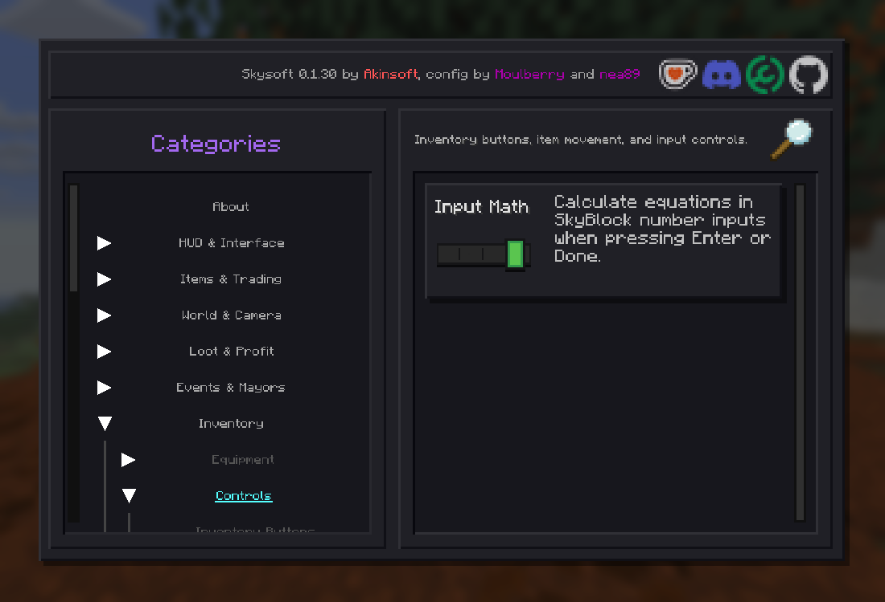

# Minecraft 26.3 compatibility validation

This is an actual Minecraft 26.3 configuration screen from the isolated,
offline Java 25 / Mesa OpenGL test of the port. The Input Math setting was
changed through the native mouse event and subsequently restored. The GUI
layout and feature belong to the existing Skysoft implementation; this is
validation of the native API port, not a new design.

The tested Skysoft JAR SHA-256 is
`498ee38d98e753ce936f7940a291e589cedd19bd12cc12f19b5588b88ca1f16b`.
Authenticated Hypixel gameplay, hardware GPUs, Vulkan and native file dialogs
were not exercised. No account data or owner configuration files are included.
